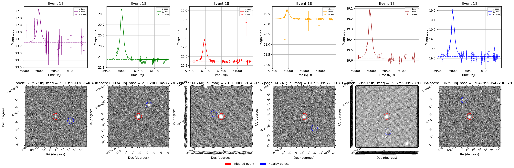

# ulens_lsst


LSST Microlensing Simulation Pipeline

## Overview

`ulens_lsst` is a Python package for obtaining image-based microlensing LSST-like light curves using LSST data (DP0, DP1, or rubin_sim). It supports versatile experimentation and parallelization.

## Installation

```bash
pip install ulens_lsst

For development:

git clone https://github.com/nowokaren/ulens_lsst.git
cd ulens_lsst
pip install -e .

### Installation Notes
- Requires the LSST stack (e.g., `lsst-scipipe-10.0.0`) for `lsst_data` and `lsst_tools`. See [LSST installation guide](https://pipelines.lsst.io/install/lsstinstall.html) or if you are working on `https://data.lsst.cloud/`:

```bash
  source /opt/lsst/software/stack/loadLSST.bash
  setup lsst_distrib

- External datasets (e.g., `chunks_TRILEGAL_Genulens`) must be placed in `ulens_lsst/data/chunks_TRILEGAL_Genulens/`. See [Data Setup](https://ulens-lsst.readthedocs.io/en/latest/data.html).
- Copy and configure config.yaml:
bashcp ulens_lsst/config/config_example.yaml config.yaml


## Usage

Command-line:

```bash
ulens-lsst --config config.yaml --steps simulate,process_photometry

## Contributors
Karen Nowogrodzki
Anibal Varela: Original author of ulens_utils module, adapted for ulens_lsst.