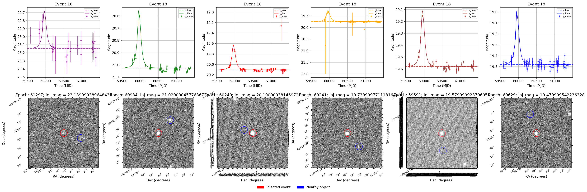

# ulens_lsst


**LSST Microlensing Simulation Pipeline**

## Overview

`ulens_lsst` is a Python package designed to generate image-based microlensing light curves using LSST-like data (DP0, DP1, or Rubin Simulation). It supports flexible experimentation, event simulation, synthetic photometry injection, and parallel processing.

## Current Status (v1.0.0)

- Fully functional end-to-end simulation in environments with the LSST Science Pipelines installed.
- Produces realistic light curves with magnification, ideal/measured fluxes, errors, and flags.
- Outputs saved as Parquet files (events, photometry, calexp-level results).
- Currently requires the LSST stack (cloud RSP or local conda env).
- Not yet published on PyPI — install from source or GitHub.

## Installation

**Prerequisites**  
Requires the LSST Science Pipelines (`lsst_distrib`).  
In LSST Rubin Science Platform (RSP) Jupyter Lab or local env:
```bash
source /opt/lsst/software/stack/loadLSST.bash   # if needed
setup lsst_distrib
```

**Install from GitHub (recommended for now)**
```bash
git clone https://github.com/nowokaren/ulens_lsst.git
cd ulens_lsst
pip install -e .
```

**Development / editable mode**
(same as above, -e is optional if you don't plan to edit code)

**External data**
Download and place TRILEGAL chunks (if using real sources catalog):

- Folder: ```ulens_lsst/data/chunks_TRILEGAL_Genulens/```
- See Data Setup for links and instructions.

**Configuration**
Copy and edit the example config:
```bash
cp config/config_example.yaml config.yaml
```
Adjust paths, sky region, number of events, model (USBL, etc.), steps, etc.

## Quick Start (tested on RSP)

1. Activate LSST stack:
```bash
setup lsst_distrib
```
2. Install package:
```bash
cd ulens_lsst
pip install -e .
```
3. Prepare config:
```bash
cp config/config_example.yaml config.yaml
```
4. Run a small simulation:
```bash 
ulens_lsst --config config.yaml --steps simulate --n_events 10
```
Results appear in ```runs/<sim_name>/``` (default: ```runs/new_test/```), including:

- ```data-events_*.parquet```
- ```photometry_*.parquet```
- ```calexps-photometry_*.parquet```

For full pipeline:
```bash
ulens_lsst --config config.yaml --steps all
```

### Command-line Options
```bash
ulens_lsst --help
```

**Main options:**

--config: Path to config.yaml (default: config.yaml)
--steps: Comma-separated (simulate, load_nearby, process_photometry, chi2, all)
--n_events: Number of events to simulate
--resume: Resume from existing simulation folder
--ra, --dec, --radius: Sky center and search radius

## Documentation
Full docs: ```https://ulens-lsst.readthedocs.io/```
(If not building yet, focus on README + notebooks in docs/tutorials/)

### Contributors

Karen Nowogrodzki
Anibal Varela: Original author of ulens_utils module, adapted for ulens_lsst

